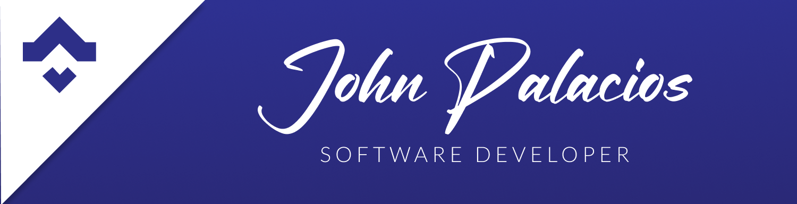

<a name="readme-top"></a>

<div align="center"> 
  
  
</div>

<!-- TABLE OF CONTENTS -->

# 📗 Table of Contents

- [📖 About the Project](#about-project)
  - [🛠 Built With](#built-with)
    - [Tech Stack](#tech-stack)
    - [Key Features](#key-features)
- [💻 Getting Started](#getting-started)
  - [Install](#install)
  - [Usage](#usage)
- [👥 Authors](#authors)
- [🔭 Future Features](#future-features)
- [🤝 Contributing](#contributing)
- [🙏 Acknowledgements](#acknowledgements)
- [📝 License](#license)

<!-- PROJECT DESCRIPTION -->

# 📖 Rails - Recipe App <a name="about-project"></a>

**The Recipe** app keeps track of all your recipes, ingredients, and inventory. It will allow you to save ingredients, keep track of what you have, create recipes, and generate a shopping list based on what you have and what you are missing from a recipe. Built with Ruby, Rails, and TailwindCSS.

## 🛠 Built With <a name="built-with"></a>

### Tech Stack <a name="tech-stack"></a>

<details>
  <summary>Client</summary>
  <ul>
    <li>
          
     <a href="https://www.ruby-lang.org/en/">Ruby</a>
    </li>
    <li>
          
      <a href="https://tailwindcss.com/">TailwindCSS</a>
    </li>
  </ul>
</details>

<details>
  <summary>Server</summary>
  <ul>
    <li>
      
      <a href="https://rubyonrails.org/">Ruby on Rails</a>
    </li>
  </ul>
</details>

<details>
<summary>Database</summary>
  <ul>
    <li>
      
      <a href="https://www.postgresql.org/">PostgreSQL</a>
    </li>
  </ul>
</details>

<!-- Features -->

### Key Features <a name="key-features"></a>

- Coming soon

<p align="right">(<a href="#readme-top">back to top</a>)</p>

<!-- GETTING STARTED -->

## 💻 Getting Started <a name="getting-started"></a>

To get a local copy up and running, follow these steps.

### Install

Install this project with:

```sh
  bundle install
  npm install
```

### Usage

To run the project, execute the following command:

```sh
  rails server
```

<!-- AUTHORS -->

## 👥 Authors <a name="authors"></a>

> Mention all of the collaborators of this project.

👤 **Karim Barragan**

- GitHub: [@rysthcraft](https://github.com/Rebelzob)
- LinkedIn: [LinkedIn](https://www.linkedin.com/in/karim-barragan/)

👤 **John Palacios**

- GitHub: [@rysthcraft](https://github.com/Rysth)
- LinkedIn: [LinkedIn](https://www.linkedin.com/in/john-palacios-rysthcraft)

<p align="right">(<a href="#readme-top">back to top</a>)</p>

<!-- FUTURE FEATURES -->

## 🔭 Future Features <a name="future-features"></a>

- [ ] **Coming soon.**

<p align="right">(<a href="#readme-top">back to top</a>)</p>

<!-- CONTRIBUTING -->

## 🤝 Contributing <a name="contributing"></a>

Contributions, issues, and feature requests are welcome!

Feel free to check the [issues page](../../issues/).

<p align="right">(<a href="#readme-top">back to top</a>)</p>

<!-- ACKNOWLEDGEMENTS -->

## 🙏 Acknowledgments <a name="acknowledgements"></a>

I would like to thanks to my family members for supporting me during Microverse, and their team.

<p align="right">(<a href="#readme-top">back to top</a>)</p>

<!-- LICENSE -->

## 📝 License <a name="license"></a>

This project is [MIT](./LICENSE.md) licensed.

<p align="right">(<a href="#readme-top">back to top</a>)</p>
